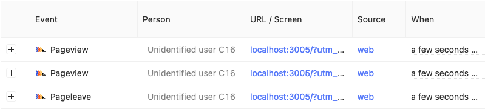

Bug report: https://github.com/Ismaaa/next-use-posthog/issues/3

### Problem

posthog registers duplicate `pageview` events a few milliseconds apart in some cases.

### Build

```
npm run build
npm run start -- -p 3005
```

### To Reproduce

Adding a query param is needed to reproduce this. You may need to refresh a few times to see it.

1. Visit URL in a browser (adblocker etc disabled): http://localhost:3005/?utm_source=google
2. See events in posthog

### pageview events (PII removed)



```
{
    "id": "017d36b5-a2af-0000-380c-ecfd4ec42bf7",
    "timestamp": "2021-11-19T05:40:10.097000+00:00",
    "event": "$pageview",
    "distinct_id": "17d3432fb7ba26-07d854be6a3937-1e396452-13c680-17d3432fb7c16c8",
    "properties": {
        "$active_feature_flags": [],
        "$browser": "Chrome",
        "$browser_version": 96,
        "$current_url": "http://localhost:3005/?utm_source=google",
        "$device_type": "Desktop",
        "$geoip_city_name": "Hyderabad",
        "$geoip_continent_code": "AS",
        "$geoip_continent_name": "Asia",
        "$geoip_country_code": "IN",
        "$geoip_country_name": "India",
        "$geoip_postal_code": "500044",
        "$geoip_subdivision_1_code": "TG",
        "$geoip_subdivision_1_name": "Telangana",
        "$geoip_time_zone": "Asia/Kolkata",
        "$host": "localhost:3005",
        "$initial_referrer": "$direct",
        "$initial_referring_domain": "$direct",
        "$insert_id": "qpfx9llzqcubwohc",
        "$lib": "web",
        "$lib_version": "1.16.0",
        "$os": "Mac OS X",
        "$pathname": "/",
        "$plugins_deferred": [],
        "$plugins_failed": [],
        "$plugins_succeeded": [
            "GeoIP (2676)",
            "URL Params Parser (Beta) (2906)"
        ],
        "$referrer": "$direct",
        "$referring_domain": "$direct",
        "$screen_height": 1080,
        "$screen_width": 1920,
        "$set": {
            "utm_source": "google"
        },
        "$set_once": {
            "$initial_os": "Mac OS X",
            "$initial_browser": "Chrome",
            "$initial_device_type": "Desktop",
            "$initial_current_url": "http://localhost:3005/?utm_source=google",
            "$initial_browser_version": 96,
            "$initial_utm_source": "google",
            "$initial_referrer": "$direct",
            "$initial_referring_domain": "$direct"
        },
        "$time": 1637300409.921,
        "$viewport_height": 976,
        "$viewport_width": 640,
        "distinct_id": "17d3432fb7ba26-07d854be6a3937-1e396452-13c680-17d3432fb7c16c8",
        "token": "phc_W0MyXawfQ5tpYpLdhzVyS2Foxjqym2BI7zdv4SZz4a9",
        "url_utm_source": "google",
        "utm_source": "google"
    },
    "elements_chain": ""
}
```

```
{
    "id": "017d36b5-9906-0000-8035-6e77ffd4064a",
    "timestamp": "2021-11-19T05:40:10.626000+00:00",
    "event": "$pageview",
    "distinct_id": "17d3432fb7ba26-07d854be6a3937-1e396452-13c680-17d3432fb7c16c8",
    "properties": {
        "$active_feature_flags": [],
        "$browser": "Chrome",
        "$browser_version": 96,
        "$current_url": "http://localhost:3005/?utm_source=google",
        "$device_type": "Desktop",
        "$geoip_city_name": "Hyderabad",
        "$geoip_continent_code": "AS",
        "$geoip_continent_name": "Asia",
        "$geoip_country_code": "IN",
        "$geoip_country_name": "India",
        "$geoip_postal_code": "500044",
        "$geoip_subdivision_1_code": "TG",
        "$geoip_subdivision_1_name": "Telangana",
        "$geoip_time_zone": "Asia/Kolkata",
        "$host": "localhost:3005",
        "$initial_referrer": "$direct",
        "$initial_referring_domain": "$direct",
        "$insert_id": "376o3f9wgqduz72j",
        "$lib": "web",
        "$lib_version": "1.16.0",
        "$os": "Mac OS X",
        "$pathname": "/",
        "$plugins_deferred": [],
        "$plugins_failed": [],
        "$plugins_succeeded": [
            "GeoIP (2676)",
            "URL Params Parser (Beta) (2906)"
        ],
        "$referrer": "$direct",
        "$referring_domain": "$direct",
        "$screen_height": 1080,
        "$screen_width": 1920,
        "$set": {
            "utm_source": "google"
        },
        "$set_once": {
            "$initial_os": "Mac OS X",
            "$initial_browser": "Chrome",
            "$initial_device_type": "Desktop",
            "$initial_current_url": "http://localhost:3005/?utm_source=google",
            "$initial_browser_version": 96,
            "$initial_utm_source": "google",
            "$initial_referrer": "$direct",
            "$initial_referring_domain": "$direct"
        },
        "$time": 1637300409.918,
        "$viewport_height": 976,
        "$viewport_width": 640,
        "distinct_id": "17d3432fb7ba26-07d854be6a3937-1e396452-13c680-17d3432fb7c16c8",
        "token": "phc_W0MyXawfQ5tpYpLdhzVyS2Foxjqym2BI7zdv4SZz4a9",
        "url_utm_source": "google",
        "utm_source": "google"
    },
    "elements_chain": ""
}
```
